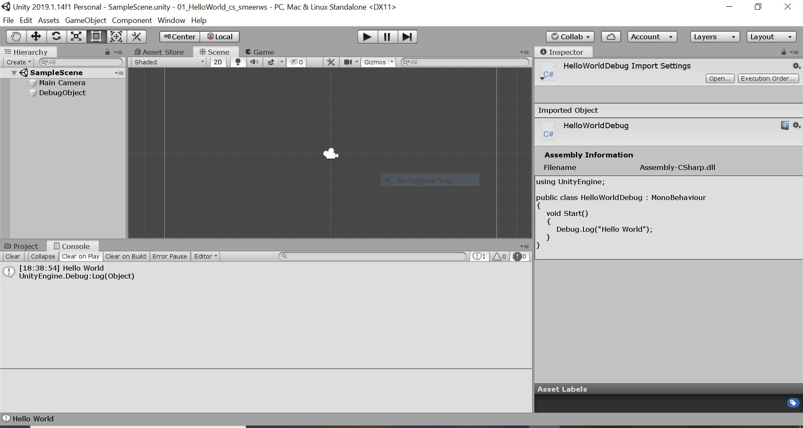

# 01_HelloWorld_cs_smeerws

**Description:** This project is a reference project for the creatation of a first Unity/C# project.
The project generates a "Hello World" as a debug message onto the unity console.
Furthermore, the project serves to practice the version control workflow with git.  

**Screenshot:** 

**Development platform:** Windows 10, Unity version 2019.1.14f1, Visual Studio Community

**Target platform:** WebGL (refres: 1280x720 smallHD)

**Third party materials:** NONE

**Lessons learned:**
 - Create a version controlled Unity project
 - Create Update a gitignore file
 - Create a C# script (Name of the Script = Name of the Class!!)
 - Add Script to GameObject
 - Create a debug log message in a script
 - Write [Markdown](https://de.wikipedia.org/wiki/Markdown#targetText=Markdown%20ist%20eine%20vereinfachte%20Auszeichnungssprache,weitere%20Konvertierung%20leicht%20lesbar%20ist)
